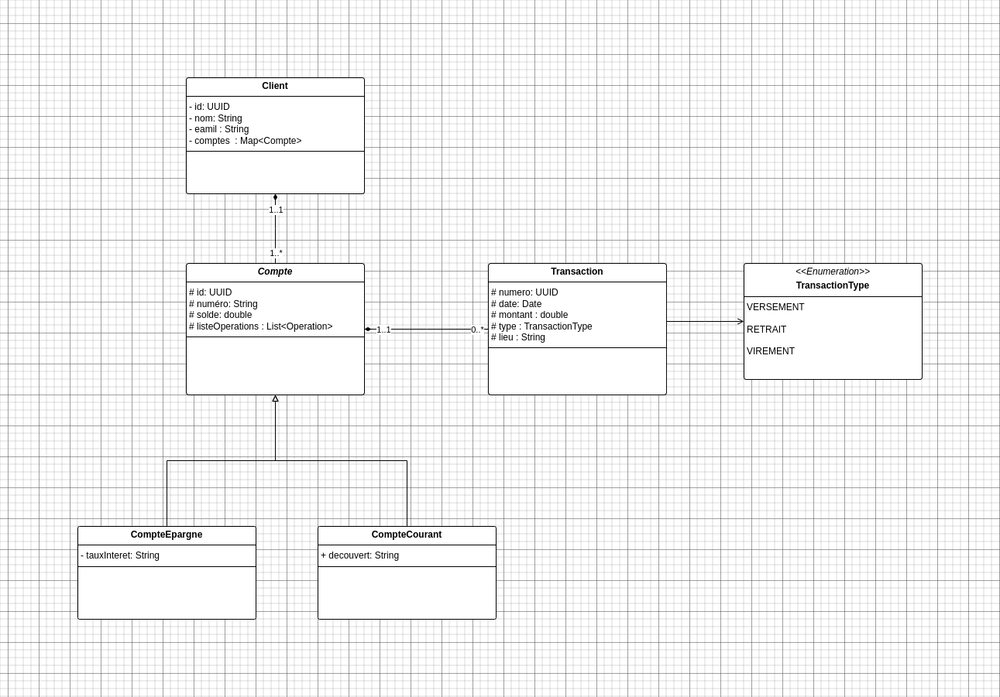

# 💳 ( BarakaGurd ) Application d’Analyse des Transactions Bancaires et Détection des Anomalies

## 📌 Contexte

Cette application permet de centraliser les données bancaires (clients, comptes, transactions), de détecter automatiquement les anomalies et de générer des rapports pour les gestionnaires et analystes financiers.

Elle est développée en **Java 17**, avec une architecture en couches et une persistance via **JDBC** (MySQL/PostgreSQL).

---

## 📂 Structure du projet

```
├── README.md
├── resources
│   ├── config.properties       # Configuration DB (URL, user, password)
│   └── sql
│       └── schema.sql          # Script SQL de création des tables
├── run.sh                      # Script pour exécuter l’application
├── run-test.sh                 # Script pour exécuter les tests
└── src
    ├── main
    │   └── java
    │       └── com
    │           └── barakaguard
    │               ├── app
    │               │   └── Main.java                  # Point d’entrée
    │               ├── dao
    │               │   ├── BaseDAO.java
    │               │   ├── ClientDAO.java
    │               │   ├── CompteDAO.java
    │               │   ├── TransactionDAO.java
    │               │   ├── implementation
    │               │   │   ├── ClientDAOImpl.java
    │               │   │   ├── CompteDAOImpl.java
    │               │   │   └── TransactionDAOImpl.java
    │               ├── dto
    │               │   ├── report                     # Objets de transfert pour les rapports
    │               │   │   ├── ClientReportDTO.java
    │               │   │   ├── CompteInactifDTO.java
    │               │   │   ├── MonthlyReportDTO.java
    │               │   │   ├── TopClientDTO.java
    │               │   │   └── TransactionSuspiciousDTO.java
    │               │   └── transaction
    │               │       └── TransactionFilter.java
    │               ├── entity
    │               │   ├── client
    │               │   │   └── Client.java
    │               │   ├── compte
    │               │   │   ├── Compte.java             # Classe sealed
    │               │   │   ├── CompteCourant.java
    │               │   │   └── CompteEpargne.java
    │               │   └── transaction
    │               │       ├── Transaction.java
    │               │       └── TypeTransaction.java    # Enum
    │               ├── exception
    │               │   ├── BusinessException.java
    │               │   ├── DAOException.java
    │               │   └── DatabaseException.java
    │               ├── service
    │               │   ├── ClientService.java
    │               │   ├── CompteService.java
    │               │   ├── TransactionService.java
    │               │   ├── RapportService.java
    │               │   ├── interfaces                  # Interfaces des services
    │               │   │   ├── BaseService.java
    │               │   │   ├── IClientService.java
    │               │   │   ├── ICompteService.java
    │               │   │   ├── ITransactionService.java
    │               │   │   └── IRapportService.java
    │               ├── ui
    │               │   ├── MenuPrincipal.java
    │               │   ├── MenuClient.java
    │               │   ├── MenuCompte.java
    │               │   ├── MenuTransaction.java
    │               │   └── MenuRapport.java
    │               └── util
    │                   ├── Database.java
    │                   ├── DateUtil.java
    │                   ├── InputUtil.java
    │                   ├── Generator.java
    │                   └── CountryExtractor.java
    └── test
```

---

## 🗄️ Base de données

* Script SQL dans `resources/sql/schema.sql`.
* Paramètres de connexion dans `resources/config.properties`.

---

## ⚙️ Installation & Exécution

### 1. Prérequis

* **Java 17**
* **PostgreSQL** ou **MySQL**
* **bash** (pour `run.sh`)

### 2. Compiler et exécuter

```bash

./run.sh

```


---

## 📊 Fonctionnalités principales

* ✅ Gestion des clients, comptes et transactions
* ✅ Détection des transactions suspectes (montants élevés, lieux inhabituels, fréquence excessive)
* ✅ Identification des comptes inactifs
* ✅ Rapports financiers : top 5 clients, statistiques mensuelles, anomalies
* ✅ Menu interactif en ligne de commande

---


## 📐 Diagramme UML

Le diagramme suivant illustre les entités principales :



👉 Le fichier source PlantUML est disponible dans `docs/diagramme-classes.puml` pour régénérer l’image.

---

## 👨‍💻 Auteur

Projet réalisé par **Ahmed Taoudi** – *SoluBank Systems*
